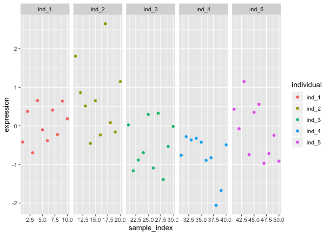
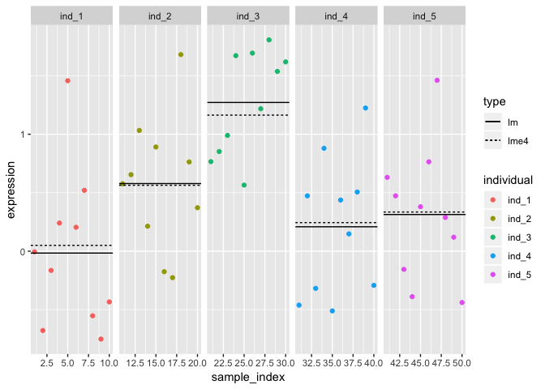
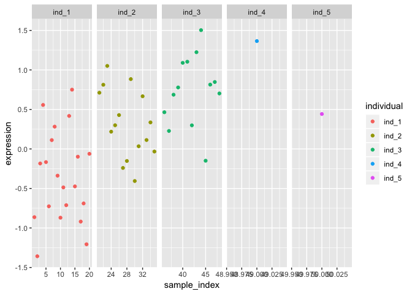
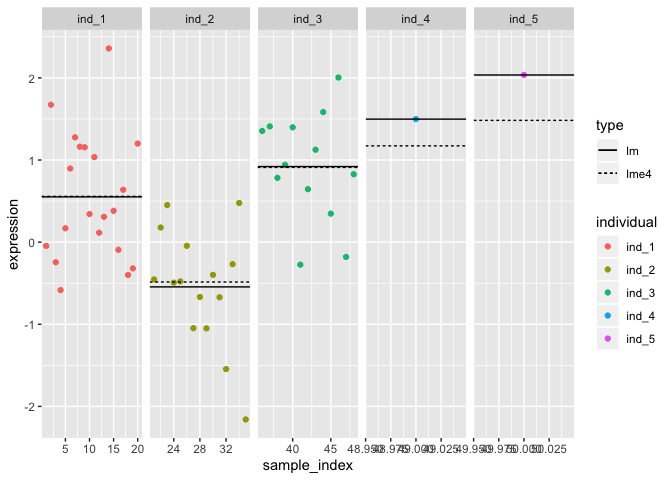

```r
library("lme4")
```

```
## Warning: package 'lme4' was built under R version 3.5.2
```

```
## Loading required package: Matrix
```

```r
library("dplyr")
```

```
## 
## Attaching package: 'dplyr'
```

```
## The following objects are masked from 'package:stats':
## 
##     filter, lag
```

```
## The following objects are masked from 'package:base':
## 
##     intersect, setdiff, setequal, union
```

```r
library("ggplot2")
```

Simulate a dataset with 5 individuals, each one containing three replicates.

Specify desired between-individual variance and measurement noise variance

```r
var_individual = 0.5
var_noise = 0.25
```


```r
#Specify the number of replicates per individual
replicate_counts = c(10,10,10,10,10)

#Sample individual means from the normal distribution with variance var_individual
individual_means = rnorm(5, mean = 0, sd = sqrt(var_individual))
ind_means = dplyr::data_frame(individual_mean = individual_means, 
                              individual = paste0("ind_", c(1:5)))

#Add replicates and sample measurement noise
data_balanced = dplyr::data_frame(individual = paste0("ind_", rep(c(1,2,3,4,5), times = replicate_counts))) %>%
  dplyr::left_join(ind_means, by = "individual") %>%
  #Sample measurement noise from the normal distribution with variance var_noise
  dplyr::mutate(noise = rnorm(length(individual), mean = 0, sd = sqrt(var_noise))) %>%
  dplyr::mutate(expression = individual_mean + noise) %>%
  dplyr::mutate(sample_index = c(1:length(individual)))
data_balanced
```

```
## # A tibble: 50 x 5
##    individual individual_mean   noise expression sample_index
##    <chr>                <dbl>   <dbl>      <dbl>        <int>
##  1 ind_1               -0.140  0.135    -0.00568            1
##  2 ind_1               -0.140 -0.538    -0.678              2
##  3 ind_1               -0.140 -0.0242   -0.165              3
##  4 ind_1               -0.140  0.381     0.241              4
##  5 ind_1               -0.140  1.60      1.46               5
##  6 ind_1               -0.140  0.345     0.204              6
##  7 ind_1               -0.140  0.661     0.520              7
##  8 ind_1               -0.140 -0.412    -0.552              8
##  9 ind_1               -0.140 -0.611    -0.752              9
## 10 ind_1               -0.140 -0.293    -0.434             10
## # ... with 40 more rows
```

Theoretical (population) variance explained by individual

```r
var_individual/(var_individual + var_noise)
```

```
## [1] 0.6666667
```

Simulated sample variance explained by individual

```r
var(individual_means)/(var(individual_means) + var(data_balanced$noise))
```

```
## [1] 0.4936102
```

Make a plot of the raw data

```r
ggplot(data_balanced, aes(x = sample_index, y = expression, color = individual)) + 
  geom_point() + 
  facet_grid(~individual, scales = "free_x")
```

<!-- -->

Specify a helper function that extract % variance explained from the linear mixed model

```r
#' Calculate the proportion of variance explaned by different factors in a lme4 model
varianceExplained <- function(lmer_model){
  variance = as.data.frame(lme4::VarCorr(lmer_model))
  var_percent = dplyr::mutate(variance, percent_variance = vcov/sum(vcov)) %>% 
    dplyr::select(grp, percent_variance) %>% 
    dplyr::mutate(type = "gene")
  var_row = tidyr::spread(var_percent, grp, percent_variance)
  return(var_row)  
}
```

Fit a linear mixed model to the dataset estimate variance explained

```r
model = lmer(expression ~ (1|individual), data_balanced)
varianceExplained(model)
```

```
##   type individual  Residual
## 1 gene  0.3898343 0.6101657
```

To the same with a standard fixed effect linear model

```r
model_fixed = lm(expression ~ individual, data_balanced)
#Estimate variance explained
summary(model_fixed)$adj.r.squared
```

```
## [1] 0.3427749
```

Extract model coefficients for random effects

```r
coefs = coef(model)$individual
coefs_df = dplyr::data_frame(individual = rownames(coefs), coef = coefs[,1], type = "lme4")
```

Estmate individual means

```r
ind_means = dplyr::group_by(data_balanced, individual) %>% 
  dplyr::summarize(coef = mean(expression), type = "lm")
```


```r
ggplot(data_balanced, aes(x = sample_index, y = expression, color = individual)) + 
  geom_point() + 
  facet_grid(~individual, scales = "free_x") + 
  geom_hline(data = coefs_df, aes(yintercept = coef, linetype = type)) +
  geom_hline(data = ind_means, aes(yintercept = coef, linetype = type))
```

<!-- -->


# Application on an unbalanced dataset


```r
#Specify the number of replicates per individual
replicate_counts = c(20,15,13,1,1)

#Sample individual means from the normal distribution with variance var_individual
individual_means = rnorm(5, mean = 0, sd = sqrt(var_individual))
ind_means = dplyr::data_frame(individual_mean = individual_means, 
                              individual = paste0("ind_", c(1:5)))

#Add replicates and sample measurement noise
data_unbalanced = dplyr::data_frame(individual = paste0("ind_", rep(c(1,2,3,4,5), times = replicate_counts))) %>%
  dplyr::left_join(ind_means, by = "individual") %>%
  #Sample measurement noise from the normal distribution with variance var_noise
  dplyr::mutate(noise = rnorm(length(individual), mean = 0, sd = sqrt(var_noise))) %>%
  dplyr::mutate(expression = individual_mean + noise) %>%
  dplyr::mutate(sample_index = c(1:length(individual)))
data_unbalanced
```

```
## # A tibble: 50 x 5
##    individual individual_mean   noise expression sample_index
##    <chr>                <dbl>   <dbl>      <dbl>        <int>
##  1 ind_1               -0.312 -0.551      -0.863            1
##  2 ind_1               -0.312 -1.05       -1.36             2
##  3 ind_1               -0.312  0.128      -0.184            3
##  4 ind_1               -0.312  0.869       0.557            4
##  5 ind_1               -0.312  0.146      -0.166            5
##  6 ind_1               -0.312 -0.414      -0.726            6
##  7 ind_1               -0.312  0.424       0.112            7
##  8 ind_1               -0.312  0.595       0.282            8
##  9 ind_1               -0.312 -0.0260     -0.338            9
## 10 ind_1               -0.312 -0.558      -0.870           10
## # ... with 40 more rows
```

Visualise the data

```r
ggplot(data_unbalanced, aes(x = sample_index, y = expression, color = individual)) + 
  geom_point() + 
  facet_grid(~individual, scales = "free_x")
```

<!-- -->

Simulated variance explained

```r
var(individual_means)/(var(individual_means) + var(data_unbalanced$noise))
```

```
## [1] 0.397906
```


```r
model = lmer(expression ~ (1|individual), data_unbalanced)
varianceExplained(model)
```

```
##   type individual  Residual
## 1 gene  0.5307627 0.4692373
```


```r
model_fixed = lm(expression ~ individual, data_unbalanced)
#Estimate variance explained
summary(model_fixed)$adj.r.squared
```

```
## [1] 0.4520339
```

Extract model coefficients for random effects

```r
coefs = coef(model)$individual
coefs_df = dplyr::data_frame(individual = rownames(coefs), coef = coefs[,1], type = "lme4")
model_df = dplyr::left_join(data_unbalanced, coefs_df, by = "individual")
```

Estmate individual means

```r
ind_means = dplyr::group_by(data_unbalanced, individual) %>% 
  dplyr::summarize(coef = mean(expression), type = "lm")
```


```r
ggplot(data_unbalanced, aes(x = sample_index, y = expression, color = individual)) + 
  geom_point() + 
  facet_grid(~individual, scales = "free_x") + 
  geom_hline(data = coefs_df, aes(yintercept = coef, linetype = type)) +
  geom_hline(data = ind_means, aes(yintercept = coef, linetype = type))
```

<!-- -->

