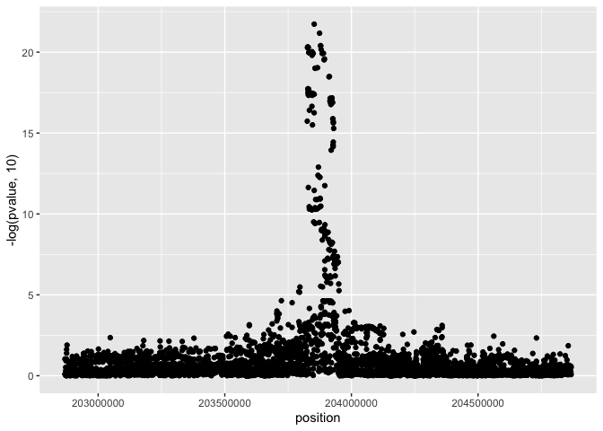
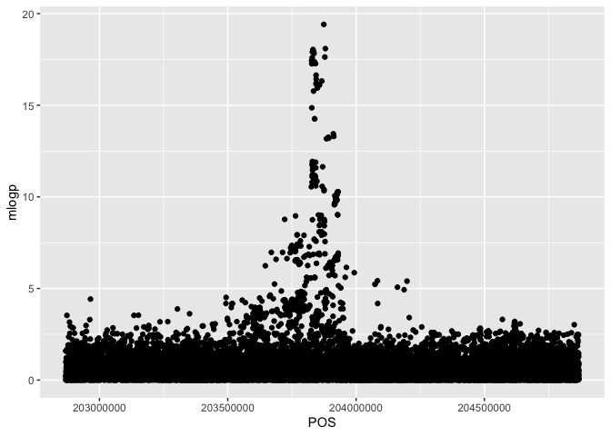
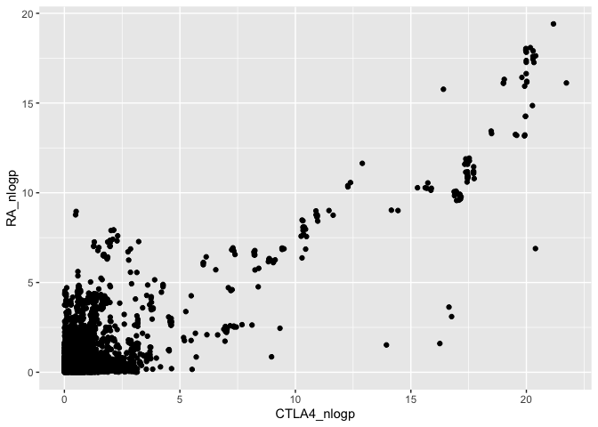

## Import the necessary R packages

``` r
library("dplyr")
library("coloc")
library("ggplot2")
```

## Import data

Import eQTL summary statistics for the CTLA4 gene in the OneK1K CD4+ T-cells.


``` r
ctla4_data = readr::read_tsv("CTLA_sumstats.tsv")
```

```
## Rows: 5765 Columns: 18
## ── Column specification ────────────────────────────────────────────────────────
## Delimiter: "\t"
## chr  (7): molecular_trait_id, ref, alt, variant, type, molecular_trait_objec...
## dbl (10): chromosome, position, ma_samples, maf, pvalue, beta, se, ac, an, r2
## lgl  (1): median_tpm
## 
## ℹ Use `spec()` to retrieve the full column specification for this data.
## ℹ Specify the column types or set `show_col_types = FALSE` to quiet this message.
```

``` r
ctla4_data
```

```
## # A tibble: 5,765 × 18
##    molecular_trait_id chromosome  position ref   alt   variant ma_samples    maf
##    <chr>                   <dbl>     <dbl> <chr> <chr> <chr>        <dbl>  <dbl>
##  1 ENSG00000163599             2 202868828 C     T     chr2_2…        370 0.239 
##  2 ENSG00000163599             2 202869266 G     A     chr2_2…        245 0.133 
##  3 ENSG00000163599             2 202869642 A     T     chr2_2…        245 0.133 
##  4 ENSG00000163599             2 202870143 C     A     chr2_2…        245 0.133 
##  5 ENSG00000163599             2 202871373 G     A     chr2_2…         40 0.0204
##  6 ENSG00000163599             2 202871479 CCG   C     chr2_2…        245 0.133 
##  7 ENSG00000163599             2 202871516 GC    G     chr2_2…         44 0.0224
##  8 ENSG00000163599             2 202871528 C     G     chr2_2…        245 0.133 
##  9 ENSG00000163599             2 202871777 C     T     chr2_2…         25 0.0127
## 10 ENSG00000163599             2 202872522 ATTT… A     chr2_2…         21 0.0107
## # ℹ 5,755 more rows
## # ℹ 10 more variables: pvalue <dbl>, beta <dbl>, se <dbl>, type <chr>,
## #   ac <dbl>, an <dbl>, r2 <dbl>, molecular_trait_object_id <chr>,
## #   gene_id <chr>, median_tpm <lgl>
```

Plot associations:

``` r
ggplot(ctla4_data, aes(x = position, y = -log(pvalue, 10))) + geom_point()
```

<!-- -->

Import GWAS results for rheumatoid arthritis (RA) from the UK Biobank + FinnGen + Million Veterns Program meta-analysis (https://mvp-ukbb.finngen.fi/)


``` r
ra_data = readr::read_tsv("RA_sumstats.tsv")
```

```
## Rows: 29166 Columns: 10
## ── Column specification ────────────────────────────────────────────────────────
## Delimiter: "\t"
## chr (5): #CHR, REF, ALT, SNP, variant
## dbl (5): POS, beta, se, p, mlogp
## 
## ℹ Use `spec()` to retrieve the full column specification for this data.
## ℹ Specify the column types or set `show_col_types = FALSE` to quiet this message.
```

``` r
ra_data
```

```
## # A tibble: 29,166 × 10
##    `#CHR`       POS REF    ALT   SNP            beta     se      p mlogp variant
##    <chr>      <dbl> <chr>  <chr> <chr>         <dbl>  <dbl>  <dbl> <dbl> <chr>  
##  1 #CHR   202868829 G      T     2:2028688… -0.711   0.435  0.102   0.99 chr2_2…
##  2 #CHR   202868969 AAAC   A     2:2028689… -0.173   0.307  0.573   0.24 chr2_2…
##  3 #CHR   202868999 A      C     2:2028689…  0.0273  0.789  0.972   0.01 chr2_2…
##  4 #CHR   202869040 TATCA  T     2:2028690… -0.313   0.594  0.599   0.22 chr2_2…
##  5 #CHR   202869266 G      A     2:2028692… -0.0279  0.0125 0.0255  1.59 chr2_2…
##  6 #CHR   202869290 G      A     2:2028692… -0.00362 0.065  0.956   0.02 chr2_2…
##  7 #CHR   202869356 CA     C     2:2028693…  0.0875  0.0888 0.325   0.49 chr2_2…
##  8 #CHR   202869372 GAAATA G     2:2028693… -0.0453  0.101  0.655   0.18 chr2_2…
##  9 #CHR   202869642 A      T     2:2028696… -0.0274  0.0123 0.0255  1.59 chr2_2…
## 10 #CHR   202869958 C      T     2:2028699… -0.93    1.16   0.422   0.37 chr2_2…
## # ℹ 29,156 more rows
```

Plot associations:

``` r
ggplot(ra_data, aes(x = POS, y = mlogp)) + geom_point()
```

<!-- -->

# Colocalisation analysis

We will be using the coloc R package to test if the genetic association with CTLA4 expression and rheumatoid arthritis is driven by the same causal variant. You can read more about the coloc method and software in this paper: https://doi.org/10.1371/journal.pgen.1004383.

First, let's prepare both datasets for colocalisation analysis.

eQTL data:


``` r
eqtl_dataset = list(snp = ctla4_data$variant, beta = ctla4_data$beta, varbeta = ctla4_data$se^2, type = "quant", sdY = 1)
coloc::check_dataset(eqtl_dataset)
```

```
## NULL
```

RA data:

``` r
gwas_dataset = list(snp = ra_data$variant, beta = ra_data$beta, varbeta = ra_data$se^2, type = "cc")
coloc::check_dataset(gwas_dataset)
```

```
## NULL
```

Test for colocalisation:

``` r
coloc.abf(eqtl_dataset, gwas_dataset, p1 = 1e-4, p2 = 1e-4, p12 = 1e-5)
```

```
## Warning in adjust_prior(p2, nrow(df2), "2"): p2 * nsnps >= 1, setting
## p2=1/(nsnps + 1)
```

```
## PP.H0.abf PP.H1.abf PP.H2.abf PP.H3.abf PP.H4.abf 
##  5.65e-32  6.64e-16  2.28e-19  2.34e-03  9.98e-01 
## [1] "PP abf for shared variant: 99.8%"
```

```
## Coloc analysis of trait 1, trait 2
```

```
## 
## SNP Priors
```

```
##           p1           p2          p12 
## 1.000000e-04 3.428532e-05 1.000000e-05
```

```
## 
## Hypothesis Priors
```

```
##         H0     H1        H2         H3      H4
##  0.1876959 0.5029 0.1724209 0.08669322 0.05029
```

```
## 
## Posterior
```

```
##        nsnps           H0           H1           H2           H3           H4 
## 5.029000e+03 5.650890e-32 6.640962e-16 2.283166e-19 2.341141e-03 9.976589e-01
```

# Visualise association signals for the two traits

``` r
joined_data = dplyr::transmute(ctla4_data, molecular_trait_id, variant, CTLA4_nlogp = -log(pvalue, 10)) %>% 
  dplyr::left_join(ra_data, by = "variant") %>% 
  dplyr::rename(RA_nlogp = mlogp)

ggplot(joined_data, aes(x = CTLA4_nlogp, y = RA_nlogp)) + geom_point()
```

```
## Warning: Removed 736 rows containing missing values or values outside the scale range
## (`geom_point()`).
```

<!-- -->
