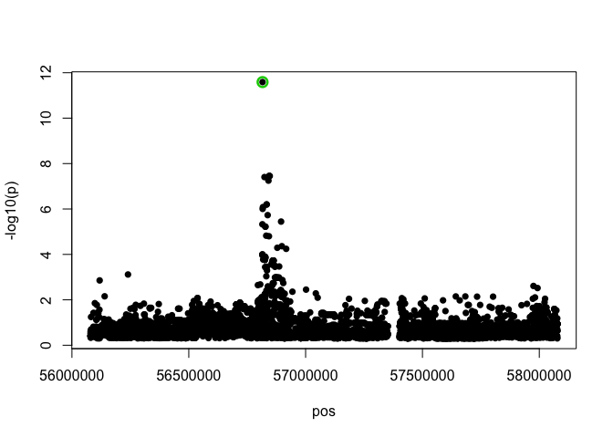
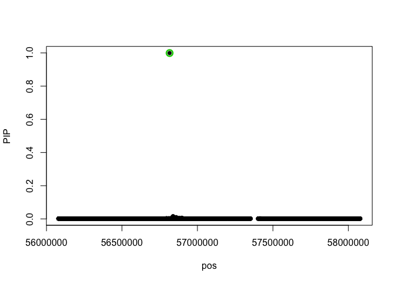

# Import data

Import CEDAR gene expression data SummarizedExperiment object


```r
se = readRDS("CEDAR_SummarizedExeperiment.rds")
se
```

```
## class: SummarizedExperiment 
## dim: 33080 2337 
## metadata(0):
## assays(1): counts
## rownames(33080): ILMN_1343291 ILMN_1343295 ... ILMN_3311180
##   ILMN_3311190
## rowData names(12): phenotype_id quant_id ... gene_version phenotype_pos
## colnames(2337): CD8IPC010 CD8IPC011 ... CD19IPC066 CD19IPC154
## colData names(21): sample_id genotype_id ... smoker included
```

Import genotype data near two genes (ARHGEF3 and LCT)


```r
arhgef3_genotypes = readRDS("CEDAR_ARHGEF3_genotypes.rds")
lct_genotyes = readRDS("CEDAR_LCT_genotypes.rds")
```

# Perform fine mapping for the ARHGEF3 gene

The CEDAR dataset gene expression data from 6 blood cell types (B-cells, monocytes, neutrophils, platelets and T-cells (CD4+ and CD8+)) and three intestinal tissues (ileum, transverse colon, rectum):


```r
table(se$qtl_group)
```

```
## 
##      B-cell_CD19            ileum    monocyte_CD14  neutrophil_CD15 
##              262              180              286              280 
##         platelet           rectum       T-cell_CD4       T-cell_CD8 
##              205              271              290              277 
## transverse_colon 
##              286
```

For the ARHGEF3 example, we first need to filter the SummarizedExperiment object to keep only the platelet samples.

```r
filtered_se = se[,se$qtl_group == "platelet"]
filtered_se
```

```
## class: SummarizedExperiment 
## dim: 33080 205 
## metadata(0):
## assays(1): counts
## rownames(33080): ILMN_1343291 ILMN_1343295 ... ILMN_3311180
##   ILMN_3311190
## rowData names(12): phenotype_id quant_id ... gene_version phenotype_pos
## colnames(205): PLAIPC233 PLAIPC203 ... PLAIPC297 PLAIPC306
## colData names(21): sample_id genotype_id ... smoker included
```

## Extracting the gene expression vector

Since CEDAR used Illumina HumanHT12_V4 microarray to measure gene expression (instead of more modern RNA-seq), we need to find out, which probe on microarray corresponded to the ARHGEF3 gene.


```r
#Find probe IDs for the CD14 gene
gene_metadata = rowData(filtered_se) %>% as.data.frame() %>% as.tbl() %>% dplyr::filter(gene_name == "ARHGEF3")
```

```
## Warning: `as.tbl()` was deprecated in dplyr 1.0.0.
## Please use `tibble::as_tibble()` instead.
## This warning is displayed once every 8 hours.
## Call `lifecycle::last_lifecycle_warnings()` to see where this warning was generated.
```

```r
gene_metadata
```

```
## # A tibble: 1 × 12
##   phenotype_id quant_id   group_id gene_id chromosome gene_start gene_end strand
##   <chr>        <chr>      <chr>    <chr>   <chr>           <int>    <int>  <int>
## 1 ILMN_1781010 ENSG00000… ENSG000… ENSG00… 3            56727418 57079329     -1
## # … with 4 more variables: gene_name <chr>, gene_type <chr>,
## #   gene_version <int>, phenotype_pos <int>
```
Next we can extract this probe from the expression matrix


```r
#Extract gene expression matrix
expression_matrix = assays(filtered_se)$counts
expression_matrix[1:5, 1:5]
```

```
##              PLAIPC233 PLAIPC203 PLAIPC204 PLAIPC093 PLAIPC120
## ILMN_1343291 13.448735 12.190502 12.729228 11.118360 12.160991
## ILMN_1343295 10.909555 10.909555 11.249935  9.933282 10.213982
## ILMN_1651209  6.633838  6.760978  6.949043  7.349271  6.856646
## ILMN_1651210  6.728042  6.734629  6.617326  6.795332  6.929682
## ILMN_1651228 11.096975 10.876020 11.230488  8.807559  9.848872
```

Replace sample_ids on columns with genotype ids to match the genotype matrix (We can do this easily, because in a SummarizedExperiment obejct, the the assays (e.g. expression matrix) as well as rowData and colData data frames are always sorted accoring to the row and colum ids)


```r
genotype_ids = colData(filtered_se) %>% as.data.frame() %>% dplyr::select(sample_id, genotype_id)
colnames(expression_matrix) = genotype_ids$genotype_id
expression_matrix[1:5, 1:5]
```

```
##                 IPC233    IPC203    IPC204    IPC093    IPC120
## ILMN_1343291 13.448735 12.190502 12.729228 11.118360 12.160991
## ILMN_1343295 10.909555 10.909555 11.249935  9.933282 10.213982
## ILMN_1651209  6.633838  6.760978  6.949043  7.349271  6.856646
## ILMN_1651210  6.728042  6.734629  6.617326  6.795332  6.929682
## ILMN_1651228 11.096975 10.876020 11.230488  8.807559  9.848872
```

Extract the probe corresponding to ARHGEF3

```r
expression_vector = expression_matrix["ILMN_1781010",]
expression_vector[1:5]
```

```
##   IPC233   IPC203   IPC204   IPC093   IPC120 
## 9.376421 9.529564 9.569639 9.580422 9.211470
```

## Extract corresponding individuals from the genotype data


```r
genotype_matrix = arhgef3_genotypes$genotypes[,names(expression_vector)]
standard_genotypes = t(genotype_matrix - apply(genotype_matrix, 1, mean))
standard_genotypes[1:5,1:5]
```

```
##        chr3_56079386_A_G chr3_56079528_G_A chr3_56079899_T_C chr3_56079903_A_G
## IPC233        -0.6097561        -0.6097561       -0.04390244        -0.6097561
## IPC203         0.3902439         0.3902439       -0.04390244         0.3902439
## IPC204         0.3902439         0.3902439       -0.04390244         0.3902439
## IPC093         0.3902439         0.3902439       -0.04390244         0.3902439
## IPC120         0.3902439         0.3902439       -0.04390244         0.3902439
##        chr3_56079938_C_T
## IPC233        0.02439024
## IPC203        0.02439024
## IPC204        0.02439024
## IPC093        0.02439024
## IPC120        0.02439024
```

## Perform finemapping 

Run the SuSiE fine mapping model. Note that you can use the coverage paramter to change to coverage of the credible set. Increasing the coverage generally makes the credible set larger, but at the same time, reduces to probability that the true causal variant is accidentally excluded from the credible set. Coverage of 99% would mean that the causal variant should be included in the credible set with 99% probability.


```r
fitted <- susieR::susie(standard_genotypes, expression_vector,
                        verbose = TRUE,
                        compute_univariate_zscore = TRUE,
                        coverage = 0.95)
```

```
## For an X with many columns, please consider installing  the Rfast package for more efficient credible set (CS)  calculations.
```

```
## [1] "objective:-155.426857168706"
## [1] "objective:-153.338704356151"
## [1] "objective:-153.295469612555"
## [1] "objective:-153.290121105067"
## [1] "objective:-153.288072517851"
## [1] "objective:-153.287878108744"
## [1] "objective:-153.287787803927"
```

```r
fitted$variant_id = colnames(standard_genotypes)
```

## Extract the variants belonging to the credible set together with their PIP

```r
credible_set = fitted$pip[fitted$sets$cs$L1]
names(credible_set) = fitted$variant_id[fitted$sets$cs$L1]
credible_set
```

```
## chr3_56815721_T_C 
##         0.9993389
```

The easiest way to to find out the rsid of this variant is to query the GTEx website with _b38 appended to the variant coordinates:
https://gtexportal.org/home/snp/chr3_56815721_T_C_b38

## Visualise the fine mapping results

Exract SNP positions for the variants included in fine mapping:


```r
pos_tbl = dplyr::tibble(snpid = colnames(standard_genotypes)) %>% dplyr::left_join(arhgef3_genotypes$snpspos)
```

```
## Joining, by = "snpid"
```

Visualise fine mapping results on top of -log10 p-values z-scores from univariate analysis:


```r
susieR::susie_plot(fitted, y = "z")
```

<!-- -->

Visualise posterior inclusion probability (PIP) for each variant directly


```r
susieR::susie_plot(fitted, y = "PIP")
```

<!-- -->


