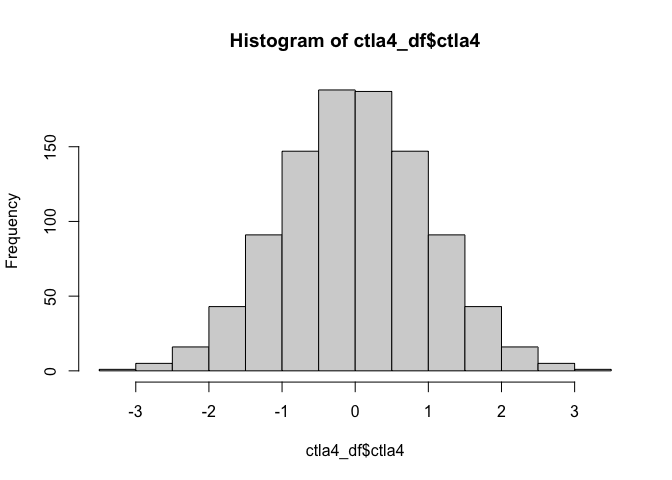
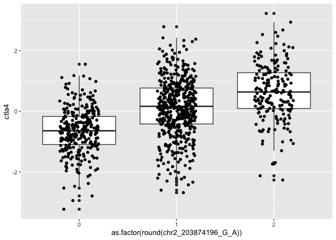
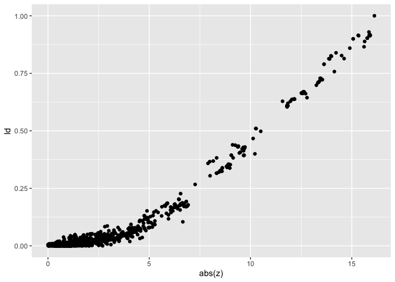
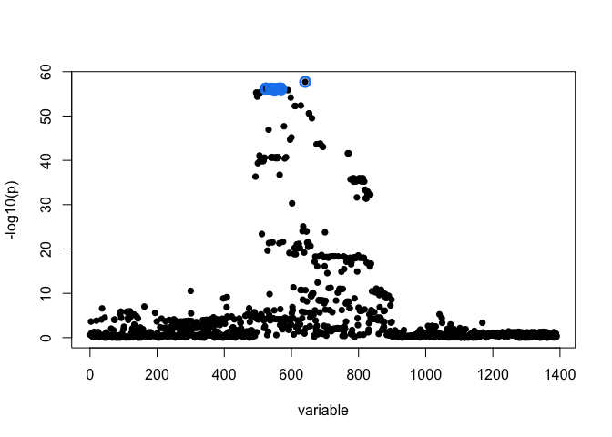

# Introduction

In this tutorial, we are going explore explore how association testing works. Our trait of interest is the expression level of the CTLA4 gene in CD4+ T-cells in the OneK1K dataset and we are going to explore how genetic variants near that gene are associated with its expression level. 

## Importing the data

All of the data that you need for this tutorial is stored in the OneK1K_CTLA4_data.tsv.gz file. Let's first read it in


``` r
ctla4_df = readr::read_tsv("OneK1K_CTLA4_data.tsv.gz", show_col_types = FALSE)
ctla4_df
```

```
## # A tibble: 981 × 1,395
##    sample_id genotype_id qtl_group sex     ctla4 chr2_203674302_G_A
##    <chr>     <chr>       <chr>     <chr>   <dbl>              <dbl>
##  1 ind_871   OneK1K_871  CD4_Naive female  0.654                  0
##  2 ind_724   OneK1K_724  CD4_Naive female  1.11                   0
##  3 ind_319   OneK1K_319  CD4_Naive female  1.42                   0
##  4 ind_45    OneK1K_45   CD4_Naive male    0.261                  0
##  5 ind_767   OneK1K_767  CD4_Naive male    0.429                  0
##  6 ind_721   OneK1K_721  CD4_Naive male    2.20                   0
##  7 ind_596   OneK1K_596  CD4_Naive male   -1.30                   0
##  8 ind_92    OneK1K_92   CD4_Naive male    0.759                  0
##  9 ind_856   OneK1K_856  CD4_Naive female -0.605                  0
## 10 ind_559   OneK1K_559  CD4_Naive female -1.69                   0
## # ℹ 971 more rows
## # ℹ 1,389 more variables: chr2_203674547_C_A <dbl>, chr2_203675250_G_A <dbl>,
## #   chr2_203677114_C_CAA <dbl>, chr2_203677388_CAT_C <dbl>,
## #   chr2_203677388_C_CATAT <dbl>, chr2_203677810_A_AT <dbl>,
## #   chr2_203677955_C_T <dbl>, chr2_203677967_C_T <dbl>,
## #   chr2_203678432_A_G <dbl>, chr2_203678522_G_A <dbl>,
## #   chr2_203679704_T_A <dbl>, chr2_203679919_C_T <dbl>, …
```
As you can see, the dataset has 981 rows corresponding to 981 individuals. The first three four columns contain some metadata about the sample, the fifth columm (ctla4) contain the normalised expression level of the CTLA4 gene in each sample. The values that you can see here are after inverse normal transformation (INT) which means that the gene expression values across individuals are normally distributed with zero mean and unit standard deviation. This is done to avoid potential outlier values that could bias linear regression.

You can check that easily:

``` r
hist(ctla4_df$ctla4)
```

<!-- -->

The remaining columns correspond to 1390 genetic variants from this gene region. Notice that even in this relatively narrow region of the genome (~400 kb or 400,000 bp) the number of genetic variants (p = 1390) already exceeds the number of samples (n = 981).

## Association testing

As mentioned in the [video lecture](https://www.youtube.com/watch?v=pglYf7wocSI), association testing is typically performed one genetic variant at a time using a simple linear regression. For example to test for an association between the chr2_203874196_G_A genetic variant and CTLA4 expression, we could use this R command:


``` r
model = lm(ctla4 ~ chr2_203874196_G_A, ctla4_df)
model
```

```
## 
## Call:
## lm(formula = ctla4 ~ chr2_203874196_G_A, data = ctla4_df)
## 
## Coefficients:
##        (Intercept)  chr2_203874196_G_A  
##            -0.5951              0.6597
```
We can also easily add in additional covariates such as the biological sex of the sample:


``` r
model = lm(ctla4 ~ chr2_203874196_G_A + sex, ctla4_df)
model
```

```
## 
## Call:
## lm(formula = ctla4 ~ chr2_203874196_G_A + sex, data = ctla4_df)
## 
## Coefficients:
##        (Intercept)  chr2_203874196_G_A             sexmale  
##           -0.57711             0.65896            -0.04096
```

Finally, we can use the broom package to extract effect sizes, standard errors and p-values from the model as a nicely formatted table:


``` r
res = broom::tidy(model)
res
```

```
## # A tibble: 3 × 5
##   term               estimate std.error statistic  p.value
##   <chr>                 <dbl>     <dbl>     <dbl>    <dbl>
## 1 (Intercept)         -0.577     0.0530   -10.9   3.66e-26
## 2 chr2_203874196_G_A   0.659     0.0410    16.1   7.53e-52
## 3 sexmale             -0.0410    0.0574    -0.714 4.76e- 1
```

As you can see, there is very strong association between the genotype of the chr2_203874196_G_A variant and CTLA4 expression (effect size = 0.65, p-value = 7.53e-43)

We can also visualise this with a boxplot:


``` r
ggplot(ctla4_df, aes(x = as.factor(round(chr2_203874196_G_A)), y = ctla4)) + 
  geom_boxplot() + 
  geom_jitter(width = 0.2)
```

<!-- -->

Now, to get the same results for all 1390 genetic variants in the region, we could run the lm() command 1390 times, but this would be quite annoying (and very slow). Fortunately there are a number of software packages such as MatrixEQTL (R), TensorQTL (Python) and FastQTL (command-line) to run these computations efficiently as matrix operations. Since we eventually, want to perform fine mapping, we are going to use the susieR R package to also get the single-variant linear regression results.

#Preparing data for fine mapping

The SuSiE method requires two inputs: (1) vector of trait values (CTLA4 expression in our case) and (2) a matrix of standardised genotypes (where all varaints have zero mean across individuals). Let's standardise the genotypes first:


``` r
gt_matrix = t(as.matrix(ctla4_df[,-c(1:5)]))
standard_genotypes = t(gt_matrix - apply(gt_matrix, 1, mean))
standard_genotypes[1:5,1:5]
```

```
##      chr2_203674302_G_A chr2_203674547_C_A chr2_203675250_G_A
## [1,]        -0.02849032        -0.02849949          0.1214699
## [2,]        -0.02849032        -0.02849949          0.1214699
## [3,]        -0.02849032        -0.02849949          0.1214699
## [4,]        -0.02849032        -0.02849949          0.1184699
## [5,]        -0.02849032        -0.02849949          0.1214699
##      chr2_203677114_C_CAA chr2_203677388_CAT_C
## [1,]          -0.02374924          -0.03175025
## [2,]          -0.02374924          -0.03075025
## [3,]          -0.02374924          -0.02975025
## [4,]          -0.02374924          -0.02975025
## [5,]          -0.02374924          -0.03175025
```
Now, let's run SuSiE:


``` r
fitted <- susieR::susie(standard_genotypes, ctla4_df$ctla4,
                        verbose = TRUE,
                        compute_univariate_zscore = TRUE,
                        coverage = 0.95)
```

```
## HINT: For an X with many columns, please consider installingthe Rfast package for more efficient credible set (CS)calculations.
```

```
## [1] "objective:-1296.55535768389"
## [1] "objective:-1284.40437243093"
## [1] "objective:-1284.33964212207"
## [1] "objective:-1284.33925520687"
## [1] "objective:-1284.33925299043"
```

``` r
fitted$variant_id = colnames(standard_genotypes)
```
and extract the univariate z scores:

``` r
z_df = dplyr::tibble(variant = fitted$variant_id, z = fitted$z) %>%
  dplyr::mutate(varaint_rank = c(1:n()))
z_df
```

```
## # A tibble: 1,390 × 3
##    variant                     z varaint_rank
##    <chr>                   <dbl>        <int>
##  1 chr2_203674302_G_A     -1.18             1
##  2 chr2_203674547_C_A     -1.18             2
##  3 chr2_203675250_G_A      3.68             3
##  4 chr2_203677114_C_CAA   -1.64             4
##  5 chr2_203677388_CAT_C    1.49             5
##  6 chr2_203677388_C_CATAT -1.18             6
##  7 chr2_203677810_A_AT    -0.618            7
##  8 chr2_203677955_C_T     -0.612            8
##  9 chr2_203677967_C_T     -1.18             9
## 10 chr2_203678432_A_G     -1.18            10
## # ℹ 1,380 more rows
```

Calculate LD between the lead variant (=variant with the largest absolute Z score) and all other variants:


``` r
ld_matrix = cor(standard_genotypes)^2
ld_with_lead = ld_matrix["chr2_203874196_G_A",]
ld_df = dplyr::tibble(ld = ld_with_lead, variant = names(ld_with_lead))
ld_df
```

```
## # A tibble: 1,390 × 2
##           ld variant               
##        <dbl> <chr>                 
##  1 0.00669   chr2_203674302_G_A    
##  2 0.00668   chr2_203674547_C_A    
##  3 0.0497    chr2_203675250_G_A    
##  4 0.00971   chr2_203677114_C_CAA  
##  5 0.0119    chr2_203677388_CAT_C  
##  6 0.00669   chr2_203677388_C_CATAT
##  7 0.000301  chr2_203677810_A_AT   
##  8 0.0000397 chr2_203677955_C_T    
##  9 0.00669   chr2_203677967_C_T    
## 10 0.00667   chr2_203678432_A_G    
## # ℹ 1,380 more rows
```
Visualise the relationship between LD with the lead variant and Z score:

``` r
joined_df = dplyr::left_join(ld_df, z_df, by = "variant")
ggplot(joined_df, aes(x = abs(z), y = ld)) + geom_point()
```

<!-- -->

As you can see, there are many variants with large absolute Z scores, but their Z scores are almost perfectly explained by their LD (r2) with the lead variant. 

# Fine mapping

Visualise fine mapping results on top of -log10 p-values z-scores from the univariate analysis:


``` r
susieR::susie_plot(fitted, y = "z")
```

<!-- -->

Visualise posterior inclusion probabilities (PIP) for each variant directly


``` r
susieR::susie_plot(fitted, y = "PIP")
```

<!-- -->

Extract variant belonging to the credible set


``` r
credible_set = fitted$pip[fitted$sets$cs$L1]
names(credible_set) = fitted$variant_id[fitted$sets$cs$L1]
credible_set
```

```
##     chr2_203832143_TA_T      chr2_203832145_A_G      chr2_203832218_G_A 
##              0.03270201              0.03270201              0.03270201 
##      chr2_203832410_A_G   chr2_203835030_ACCT_A      chr2_203835966_C_T 
##              0.03270201              0.03319958              0.03037987 
##      chr2_203837937_C_T  chr2_203838526_TGGAG_T chr2_203838535_T_TAAACC 
##              0.02699312              0.02407409              0.02407409 
##      chr2_203842142_A_T      chr2_203843923_C_T      chr2_203844053_T_A 
##              0.03108671              0.03413672              0.03232296 
##      chr2_203844626_C_G     chr2_203844657_A_AT      chr2_203874196_G_A 
##              0.03412717              0.02489787              0.52893981
```
