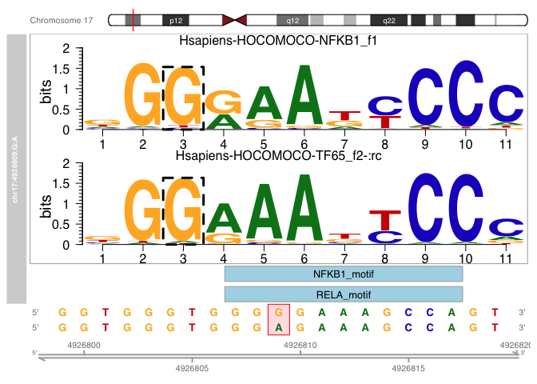

#Importing the required packages

```r
library("motifbreakR")
```

```
## Loading required package: grid
```

```
## Loading required package: MotifDb
```

```
## Loading required package: BiocGenerics
```

```
## Loading required package: parallel
```

```
## 
## Attaching package: 'BiocGenerics'
```

```
## The following objects are masked from 'package:parallel':
## 
##     clusterApply, clusterApplyLB, clusterCall, clusterEvalQ,
##     clusterExport, clusterMap, parApply, parCapply, parLapply,
##     parLapplyLB, parRapply, parSapply, parSapplyLB
```

```
## The following objects are masked from 'package:stats':
## 
##     IQR, mad, sd, var, xtabs
```

```
## The following objects are masked from 'package:base':
## 
##     anyDuplicated, append, as.data.frame, basename, cbind, colnames,
##     dirname, do.call, duplicated, eval, evalq, Filter, Find, get, grep,
##     grepl, intersect, is.unsorted, lapply, Map, mapply, match, mget,
##     order, paste, pmax, pmax.int, pmin, pmin.int, Position, rank,
##     rbind, Reduce, rownames, sapply, setdiff, sort, table, tapply,
##     union, unique, unsplit, which.max, which.min
```

```
## Loading required package: S4Vectors
```

```
## Loading required package: stats4
```

```
## 
## Attaching package: 'S4Vectors'
```

```
## The following object is masked from 'package:base':
## 
##     expand.grid
```

```
## Loading required package: IRanges
```

```
## Loading required package: GenomicRanges
```

```
## Loading required package: GenomeInfoDb
```

```
## Loading required package: Biostrings
```

```
## Loading required package: XVector
```

```
## 
## Attaching package: 'Biostrings'
```

```
## The following object is masked from 'package:base':
## 
##     strsplit
```

```
## See system.file("LICENSE", package="MotifDb") for use restrictions.
```

```
## Warning: replacing previous import 'S4Vectors::as.data.frame' by
## 'motifStack::as.data.frame' when loading 'motifbreakR'
```

```r
library("MotifDb")
library("BSgenome.Hsapiens.UCSC.hg38")
```

```
## Loading required package: BSgenome
```

```
## Loading required package: rtracklayer
```

```r
library("dplyr")
```

```
## 
## Attaching package: 'dplyr'
```

```
## The following objects are masked from 'package:Biostrings':
## 
##     collapse, intersect, setdiff, setequal, union
```

```
## The following object is masked from 'package:XVector':
## 
##     slice
```

```
## The following objects are masked from 'package:GenomicRanges':
## 
##     intersect, setdiff, union
```

```
## The following object is masked from 'package:GenomeInfoDb':
## 
##     intersect
```

```
## The following objects are masked from 'package:IRanges':
## 
##     collapse, desc, intersect, setdiff, slice, union
```

```
## The following objects are masked from 'package:S4Vectors':
## 
##     first, intersect, rename, setdiff, setequal, union
```

```
## The following objects are masked from 'package:BiocGenerics':
## 
##     combine, intersect, setdiff, union
```

```
## The following objects are masked from 'package:stats':
## 
##     filter, lag
```

```
## The following objects are masked from 'package:base':
## 
##     intersect, setdiff, setequal, union
```

```r
library("GenomicRanges")
```

#Import credible sets from the eQTL Catalogue

First, we need to download the eQTL fine mapping results from the Alasoo_2018 study from macrophages stimulated with interferon-gamma and Salmonella. 


```r
cs_table = readr::read_tsv("ftp://ftp.ebi.ac.uk/pub/databases/spot/eQTL/credible_sets/Alasoo_2018.macrophage_IFNg+Salmonella_ge.purity_filtered.txt.gz")
```

```
## 
## ── Column specification ────────────────────────────────────────────────────────
## cols(
##   phenotype_id = col_character(),
##   variant_id = col_character(),
##   chr = col_double(),
##   pos = col_double(),
##   ref = col_character(),
##   alt = col_character(),
##   cs_id = col_character(),
##   cs_index = col_character(),
##   finemapped_region = col_character(),
##   pip = col_double(),
##   z = col_double(),
##   cs_min_r2 = col_double(),
##   cs_avg_r2 = col_double(),
##   cs_size = col_double(),
##   posterior_mean = col_double(),
##   posterior_sd = col_double(),
##   cs_log10bf = col_double()
## )
```

# GP1BA
Next, let's extract the credible set for the GP1BA gene (ENSG00000185245):


```r
GP1BA_cs = dplyr::filter(cs_table, phenotype_id == "ENSG00000185245")
GP1BA_cs
```

```
## # A tibble: 8 x 17
##   phenotype_id   variant_id         chr     pos ref   alt   cs_id       cs_index
##   <chr>          <chr>            <dbl>   <dbl> <chr> <chr> <chr>       <chr>   
## 1 ENSG000001852… chr17_4922449_A…    17 4922449 AAAAT A     ENSG000001… L1      
## 2 ENSG000001852… chr17_4925554_C…    17 4925554 C     G     ENSG000001… L1      
## 3 ENSG000001852… chr17_4926692_A…    17 4926692 A     G     ENSG000001… L1      
## 4 ENSG000001852… chr17_4926809_G…    17 4926809 G     A     ENSG000001… L1      
## 5 ENSG000001852… chr17_4930090_T…    17 4930090 T     C     ENSG000001… L1      
## 6 ENSG000001852… chr17_4935854_C…    17 4935854 C     T     ENSG000001… L1      
## 7 ENSG000001852… chr17_4942473_G…    17 4942473 G     A     ENSG000001… L1      
## 8 ENSG000001852… chr17_4951185_C…    17 4951185 C     T     ENSG000001… L1      
## # … with 9 more variables: finemapped_region <chr>, pip <dbl>, z <dbl>,
## #   cs_min_r2 <dbl>, cs_avg_r2 <dbl>, cs_size <dbl>, posterior_mean <dbl>,
## #   posterior_sd <dbl>, cs_log10bf <dbl>
```

We can see that this credible set consists of eight variants, one of which is an indel (chr17_4922449_AAAAT_A). Although motifbreakR package should in principle support indels, I could not get it to work right now, so we are going to exclude the indel for now. When performing real analysis, you should always consider indels as well, because they can often be the true causal variant. 


```r
GP1BA_cs_no_indel = GP1BA_cs %>%
  dplyr::mutate(max_allele_nchar = pmax(nchar(ref), nchar(alt))) %>%
  dplyr::filter(max_allele_nchar == 1)
GP1BA_cs_no_indel
```

```
## # A tibble: 7 x 18
##   phenotype_id   variant_id        chr    pos ref   alt   cs_id         cs_index
##   <chr>          <chr>           <dbl>  <dbl> <chr> <chr> <chr>         <chr>   
## 1 ENSG000001852… chr17_4925554_…    17 4.93e6 C     G     ENSG00000185… L1      
## 2 ENSG000001852… chr17_4926692_…    17 4.93e6 A     G     ENSG00000185… L1      
## 3 ENSG000001852… chr17_4926809_…    17 4.93e6 G     A     ENSG00000185… L1      
## 4 ENSG000001852… chr17_4930090_…    17 4.93e6 T     C     ENSG00000185… L1      
## 5 ENSG000001852… chr17_4935854_…    17 4.94e6 C     T     ENSG00000185… L1      
## 6 ENSG000001852… chr17_4942473_…    17 4.94e6 G     A     ENSG00000185… L1      
## 7 ENSG000001852… chr17_4951185_…    17 4.95e6 C     T     ENSG00000185… L1      
## # … with 10 more variables: finemapped_region <chr>, pip <dbl>, z <dbl>,
## #   cs_min_r2 <dbl>, cs_avg_r2 <dbl>, cs_size <dbl>, posterior_mean <dbl>,
## #   posterior_sd <dbl>, cs_log10bf <dbl>, max_allele_nchar <int>
```

Next, we need format the credible set variant so that they will work with motifbreakR. This is a bit annoying as we need to first save the varianta into a text file in BED format and then read them back into R. 

```r
GP1BA_snps = dplyr::transmute(GP1BA_cs_no_indel, 
                              V1 = paste0("chr",chr), 
                              V2 = pos - 1, 
                              V3 = pos, 
                              V4 = paste(paste0("chr",chr), pos, ref, alt, sep = ":"), 
                              V5 = 0, 
                              V6 = "+")
write.table(GP1BA_snps, "snps_bed.tsv", sep = "\t", row.names = F, quote = F, col.names = F)
GP1BA_granges <- motifbreakR::snps.from.file(file = "snps_bed.tsv",
                                  search.genome = BSgenome.Hsapiens.UCSC.hg38,
                                  format = "bed")
GP1BA_granges
```

```
## GRanges object with 7 ranges and 3 metadata columns:
##                     seqnames    ranges strand |            SNP_id
##                        <Rle> <IRanges>  <Rle> |       <character>
##   chr17:4925554:C:G    chr17   4925554      * | chr17:4925554:C:G
##   chr17:4926692:A:G    chr17   4926692      * | chr17:4926692:A:G
##   chr17:4926809:G:A    chr17   4926809      * | chr17:4926809:G:A
##   chr17:4930090:T:C    chr17   4930090      * | chr17:4930090:T:C
##   chr17:4935854:C:T    chr17   4935854      * | chr17:4935854:C:T
##   chr17:4942473:G:A    chr17   4942473      * | chr17:4942473:G:A
##   chr17:4951185:C:T    chr17   4951185      * | chr17:4951185:C:T
##                                REF            ALT
##                     <DNAStringSet> <DNAStringSet>
##   chr17:4925554:C:G              C              G
##   chr17:4926692:A:G              A              G
##   chr17:4926809:G:A              G              A
##   chr17:4930090:T:C              T              C
##   chr17:4935854:C:T              C              T
##   chr17:4942473:G:A              G              A
##   chr17:4951185:C:T              C              T
##   -------
##   seqinfo: 1 sequence from hg38 genome
```

# Overlap with ATAC-seq data
Next, we can ask which of the seven credible set variants overlap with accessible chromatin regions in macrophage. To do this, we first need to import all of the accessible regions identified with ATAC-seq in the Alasoo_2018 study.


```r
peaks = rtracklayer::import.gff3("https://zenodo.org/record/1188300/files/ATAC_consensus_peaks.gff3.gz")
seqlevelsStyle(peaks) <- "UCSC" #This make chromosome names compatible with the motifbreakR object
peaks
```

```
## GRanges object with 296908 ranges and 5 metadata columns:
##            seqnames            ranges strand |      source     type     score
##               <Rle>         <IRanges>  <Rle> |    <factor> <factor> <numeric>
##        [1]     chr1        9979-10668      + | rtracklayer     exon        NA
##        [2]     chr1       10939-11473      + | rtracklayer     exon        NA
##        [3]     chr1       15505-15729      + | rtracklayer     exon        NA
##        [4]     chr1       21148-21481      + | rtracklayer     exon        NA
##        [5]     chr1       21864-22067      + | rtracklayer     exon        NA
##        ...      ...               ...    ... .         ...      ...       ...
##   [296904]     chrY 56838945-56839087      + | rtracklayer     exon        NA
##   [296905]     chrY 56842226-56842490      + | rtracklayer     exon        NA
##   [296906]     chrY 56847117-56847262      + | rtracklayer     exon        NA
##   [296907]     chrY 56850324-56850559      + | rtracklayer     exon        NA
##   [296908]     chrY 56850698-56851195      + | rtracklayer     exon        NA
##                phase          gene_id
##            <integer>      <character>
##        [1]      <NA>      ATAC_peak_1
##        [2]      <NA>      ATAC_peak_2
##        [3]      <NA>      ATAC_peak_3
##        [4]      <NA>      ATAC_peak_4
##        [5]      <NA>      ATAC_peak_5
##        ...       ...              ...
##   [296904]      <NA> ATAC_peak_296904
##   [296905]      <NA> ATAC_peak_296905
##   [296906]      <NA> ATAC_peak_296906
##   [296907]      <NA> ATAC_peak_296907
##   [296908]      <NA> ATAC_peak_296908
##   -------
##   seqinfo: 24 sequences from an unspecified genome; no seqlengths
```

Now we can find the variants the overlap open chromatin regions:

```r
olaps = GenomicRanges::findOverlaps(GP1BA_granges, peaks)
GP1BA_olaps = GP1BA_granges[queryHits(olaps)]
GP1BA_olaps
```

```
## GRanges object with 2 ranges and 3 metadata columns:
##                     seqnames    ranges strand |            SNP_id
##                        <Rle> <IRanges>  <Rle> |       <character>
##   chr17:4926692:A:G    chr17   4926692      * | chr17:4926692:A:G
##   chr17:4926809:G:A    chr17   4926809      * | chr17:4926809:G:A
##                                REF            ALT
##                     <DNAStringSet> <DNAStringSet>
##   chr17:4926692:A:G              A              G
##   chr17:4926809:G:A              G              A
##   -------
##   seqinfo: 1 sequence from hg38 genome
```

Finally, we can use motifbreakR together with the HOCOMOCO database to identify transcription factors whose motifs might be disrupted by these genetic variants:


```r
results <- motifbreakR(snpList = GP1BA_olaps, filterp = TRUE,
                       pwmList = hocomoco,
                       threshold = 1e-4,
                       method = "ic",
                       bkg = c(A=0.25, C=0.25, G=0.25, T=0.25),
                       BPPARAM = BiocParallel::bpparam())
results_df = dplyr::as_tibble(as.data.frame(elementMetadata(results)))
results_df
```

```
## # A tibble: 8 x 19
##   SNP_id         REF   ALT   varType motifPos geneSymbol dataSource providerName
##   <chr>          <chr> <chr> <chr>   <I<list> <chr>      <chr>      <chr>       
## 1 chr17:4926809… G     A     SNV     <dbl [2… SP3        HOCOMOCO   SP3_f1      
## 2 chr17:4926809… G     A     SNV     <dbl [2… KLF4       HOCOMOCO   KLF4_f2     
## 3 chr17:4926809… G     A     SNV     <dbl [2… SP1        HOCOMOCO   SP1_f2      
## 4 chr17:4926809… G     A     SNV     <dbl [2… MAZ        HOCOMOCO   MAZ_f1      
## 5 chr17:4926809… G     A     SNV     <dbl [2… IKZF1      HOCOMOCO   IKZF1_f1    
## 6 chr17:4926809… G     A     SNV     <dbl [2… SP1        HOCOMOCO   SP1_f1      
## 7 chr17:4926809… G     A     SNV     <dbl [2… KLF1       HOCOMOCO   KLF1_f1     
## 8 chr17:4926809… G     A     SNV     <dbl [2… HIVEP2     HOCOMOCO   ZEP2_si     
## # … with 11 more variables: providerId <chr>, seqMatch <chr>, pctRef <dbl>,
## #   pctAlt <dbl>, scoreRef <dbl>, scoreAlt <dbl>, Refpvalue <lgl>,
## #   Altpvalue <lgl>, altPos <int>, alleleDiff <dbl>, effect <chr>
```

To identify more potential hits, we can reduce the p-value threshold to 1e-3:


```r
results <- motifbreakR(snpList = GP1BA_olaps, filterp = TRUE,
                       pwmList = hocomoco,
                       threshold = 1e-3,
                       method = "ic",
                       bkg = c(A=0.25, C=0.25, G=0.25, T=0.25),
                       BPPARAM = BiocParallel::bpparam())
results_df = dplyr::as_tibble(as.data.frame(elementMetadata(results)))
results_df
```

```
## # A tibble: 30 x 19
##    SNP_id        REF   ALT   varType motifPos geneSymbol dataSource providerName
##    <chr>         <chr> <chr> <chr>   <I<list> <chr>      <chr>      <chr>       
##  1 chr17:492669… A     G     SNV     <dbl [2… FOXF1      HOCOMOCO   FOXF1_f1    
##  2 chr17:492669… A     G     SNV     <dbl [2… FOXF2      HOCOMOCO   FOXF2_f1    
##  3 chr17:492669… A     G     SNV     <dbl [2… FOXJ2      HOCOMOCO   FOXJ2_f1    
##  4 chr17:492669… A     G     SNV     <dbl [2… HIVEP2     HOCOMOCO   ZEP2_si     
##  5 chr17:492669… A     G     SNV     <dbl [2… NFATC2     HOCOMOCO   NFAC2_f1    
##  6 chr17:492669… A     G     SNV     <dbl [2… NFATC4     HOCOMOCO   NFAC4_f1    
##  7 chr17:492669… A     G     SNV     <dbl [2… ZBTB4      HOCOMOCO   ZBTB4_si    
##  8 chr17:492680… G     A     SNV     <dbl [2… HIVEP2     HOCOMOCO   ZEP2_si     
##  9 chr17:492680… G     A     SNV     <dbl [2… IKZF1      HOCOMOCO   IKZF1_f1    
## 10 chr17:492680… G     A     SNV     <dbl [2… KLF1       HOCOMOCO   KLF1_f1     
## # … with 20 more rows, and 11 more variables: providerId <chr>, seqMatch <chr>,
## #   pctRef <dbl>, pctAlt <dbl>, scoreRef <dbl>, scoreAlt <dbl>,
## #   Refpvalue <lgl>, Altpvalue <lgl>, altPos <int>, alleleDiff <dbl>,
## #   effect <chr>
```
The NFKB transcription factor consists of multiple sub-units. In this case, we can look for both NFKB1 and RELA:


```r
nfkb_results = results[results$geneSymbol %in% c("NFKB1", "RELA"),]
plotMB(results = nfkb_results, rsid = "chr17:4926809:G:A", effect = "strong")
```

```
## Warning:   Using providerVersion() on a BSgenome object is deprecated. Please use
##   'metadata(x)$genome' instead.
```

<!-- -->


# SPOPL


```r
cs_table = readr::read_tsv("ftp://ftp.ebi.ac.uk/pub/databases/spot/eQTL/credible_sets/Alasoo_2018.macrophage_IFNg_ge.purity_filtered.txt.gz")
```

```
## 
## ── Column specification ────────────────────────────────────────────────────────
## cols(
##   phenotype_id = col_character(),
##   variant_id = col_character(),
##   chr = col_double(),
##   pos = col_double(),
##   ref = col_character(),
##   alt = col_character(),
##   cs_id = col_character(),
##   cs_index = col_character(),
##   finemapped_region = col_character(),
##   pip = col_double(),
##   z = col_double(),
##   cs_min_r2 = col_double(),
##   cs_avg_r2 = col_double(),
##   cs_size = col_double(),
##   posterior_mean = col_double(),
##   posterior_sd = col_double(),
##   cs_log10bf = col_double()
## )
```

```r
SPOPL_cs = dplyr::filter(cs_table, phenotype_id == "ENSG00000144228")
SPOPL_cs
```

```
## # A tibble: 10 x 17
##    phenotype_id   variant_id        chr     pos ref   alt   cs_id       cs_index
##    <chr>          <chr>           <dbl>   <dbl> <chr> <chr> <chr>       <chr>   
##  1 ENSG000001442… chr2_138681466…     2  1.39e8 C     T     ENSG000001… L1      
##  2 ENSG000001442… chr2_138683151…     2  1.39e8 T     C     ENSG000001… L1      
##  3 ENSG000001442… chr2_138684717…     2  1.39e8 C     T     ENSG000001… L1      
##  4 ENSG000001442… chr2_138685558…     2  1.39e8 T     C     ENSG000001… L1      
##  5 ENSG000001442… chr2_138688844…     2  1.39e8 C     T     ENSG000001… L1      
##  6 ENSG000001442… chr2_138690030…     2  1.39e8 C     G     ENSG000001… L1      
##  7 ENSG000001442… chr2_138690161…     2  1.39e8 G     A     ENSG000001… L1      
##  8 ENSG000001442… chr2_138691588…     2  1.39e8 G     A     ENSG000001… L1      
##  9 ENSG000001442… chr2_138697527…     2  1.39e8 A     G     ENSG000001… L1      
## 10 ENSG000001442… chr2_138702169…     2  1.39e8 T     C     ENSG000001… L1      
## # … with 9 more variables: finemapped_region <chr>, pip <dbl>, z <dbl>,
## #   cs_min_r2 <dbl>, cs_avg_r2 <dbl>, cs_size <dbl>, posterior_mean <dbl>,
## #   posterior_sd <dbl>, cs_log10bf <dbl>
```
