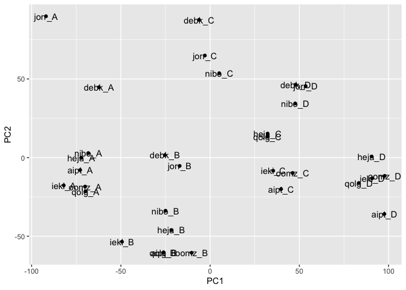

First, we need to load the libraries:


```r
library("SummarizedExperiment")
library("DESeq2")
library("dplyr")
library("gplots")
library("ggplot2")
```

## Importing the data

First, download the full dataset from the course [website](https://zenodo.org/records/10805436/files/RNA_SummarizedExperiment.rds?download=1).

Now you can import the dataset into R using the following command:


```r
	dataset = readRDS("../data/RNA_SummarizedExperiment.rds")
```


Here, `dataset` is an [SummarizedExperiment](https://bioconductor.org/packages/release/bioc/vignettes/SummarizedExperiment/inst/doc/SummarizedExperiment.html)  object. The key advantage of using SummarizedExperiment class is that the gene expression read count matrix is always stored together with the accompanying gene and sample metadata. Consequently, when you subset the data, SummarizedExperiment ensures that the metadata is always synchronised with the expression data itself. I strongly recommend you read the  [SummarizedExperiment](https://bioconductor.org/packages/release/bioc/vignettes/SummarizedExperiment/inst/doc/SummarizedExperiment.html) tutorial to learn how to perform basic operations with these objects.

You can see the summary of the dataset by just printing it out:

```r
	dataset
```

```
## class: SummarizedExperiment 
## dim: 35033 336 
## metadata(0):
## assays(1): counts
## rownames(35033): ENSG00000198888 ENSG00000198763 ... ENSG00000233136
##   ENSG00000165795
## rowData names(11): gene_id gene_biotype ... exon_starts exon_ends
## colnames(336): aipt_A aipt_B ... zuta_C zuta_D
## colData names(44): sample_id donor ... mean_purity_filtered purity_bins
```
The `## dim` line tells to that this dataset has 35033 genes and 336 samples. 

You can view the sample metadata (first 5 rows and columns) using the `colData()` function:

```r
	colData(dataset)[1:5,1:5]
```

```
## DataFrame with 5 rows and 5 columns
##          sample_id       donor   condition replicate condition_name
##        <character> <character> <character> <integer>    <character>
## aipt_A      aipt_A        aipt           A         1          naive
## aipt_B      aipt_B        aipt           B         1           IFNg
## aipt_C      aipt_C        aipt           C         1         SL1344
## aipt_D      aipt_D        aipt           D         1    IFNg_SL1344
## auim_A      auim_A        auim           A         1          naive
```
And you can do the same for gene metadata:

```r
	rowData(dataset)[1:5,]
```

```
## DataFrame with 5 rows and 11 columns
##                         gene_id   gene_biotype         chr gene_strand
##                     <character>    <character> <character>   <integer>
## ENSG00000198888 ENSG00000198888 protein_coding          MT           1
## ENSG00000198763 ENSG00000198763 protein_coding          MT           1
## ENSG00000198804 ENSG00000198804 protein_coding          MT           1
## ENSG00000198712 ENSG00000198712 protein_coding          MT           1
## ENSG00000228253 ENSG00000228253 protein_coding          MT           1
##                 gene_start  gene_end percentage_gc_content   gene_name
##                  <integer> <integer>             <numeric> <character>
## ENSG00000198888       3307      4262                 47.70      MT-ND1
## ENSG00000198763       4470      5511                 42.99      MT-ND2
## ENSG00000198804       5904      7445                 46.24      MT-CO1
## ENSG00000198712       7586      8269                 46.20      MT-CO2
## ENSG00000228253       8366      8572                 39.61     MT-ATP8
##                    length exon_starts   exon_ends
##                 <integer> <character> <character>
## ENSG00000198888       956        3307        4262
## ENSG00000198763      1042        4470        5511
## ENSG00000198804      1542        5904        7445
## ENSG00000198712       684        7586        8269
## ENSG00000228253       207        8366        8572
```

Finally, to view the raw read counts, you can use the assays command:

```r
	assays(dataset)
```

```
## List of length 1
## names(1): counts
```


```r
	assays(dataset)$counts[1:5,1:5]
```

```
##                 aipt_A aipt_B aipt_C aipt_D auim_A
## ENSG00000198888  71321  43991  65274  92505  78993
## ENSG00000198763  83356  37810  66529  81534  62912
## ENSG00000198804 434520 232305 411873 545619 219557
## ENSG00000198712 172090  72174 150233 168686  93480
## ENSG00000228253  20189  11908  20965  24346  17239
```

# Subsetting
To illustrate the power of SummarizedExperiment, let's take a random subset of the data containing eight random donors. First, let's identify the donors:

```r
	set.seed(1)
  donors_subset = colData(dataset)$donor %>% unique() %>% sample(8)
  donors_subset
```

```
## [1] "qolg" "ieki" "aipt" "heja" "jorr" "debk" "oomz" "nibo"
```
Note that I used the `%>%` (pipe) operator from the [dplyr](https://dplyr.tidyverse.org/) pacakge. The last command is exactly equivalent (but more readable) as the following:

```r
	set.seed(1)
  donors_subset = sample(unique(colData(dataset)$donor),8)
  donors_subset
```

```
## [1] "qolg" "ieki" "aipt" "heja" "jorr" "debk" "oomz" "nibo"
```

Now we can just subset the original dataset:

```r
data_subset = dataset[,dataset$donor %in% donors_subset]
data_subset
```

```
## class: SummarizedExperiment 
## dim: 35033 32 
## metadata(0):
## assays(1): counts
## rownames(35033): ENSG00000198888 ENSG00000198763 ... ENSG00000233136
##   ENSG00000165795
## rowData names(11): gene_id gene_biotype ... exon_starts exon_ends
## colnames(32): aipt_A aipt_B ... qolg_C qolg_D
## colData names(44): sample_id donor ... mean_purity_filtered purity_bins
```
Note the that we now have 8 donors x 4 conditions = 32 samples.

# Expolratory data analysis
We will use the [DESeq2](https://bioconductor.org/packages/release/bioc/html/DESeq2.html) package to analyse the RNA-seq data. DESeq2 also has [excellent documentation](https://bioconductor.org/packages/release/bioc/vignettes/DESeq2/inst/doc/DESeq2.html). 

First, let's convert the SummarizedExperiment object into a DESeq object:

```r
dds <- DESeqDataSet(data_subset, design = ~ condition_name)
```

```
## Warning in DESeqDataSet(data_subset, design = ~condition_name): some variables
## in design formula are characters, converting to factors
```

```r
dds
```

```
## class: DESeqDataSet 
## dim: 35033 32 
## metadata(1): version
## assays(1): counts
## rownames(35033): ENSG00000198888 ENSG00000198763 ... ENSG00000233136
##   ENSG00000165795
## rowData names(11): gene_id gene_biotype ... exon_starts exon_ends
## colnames(32): aipt_A aipt_B ... qolg_C qolg_D
## colData names(44): sample_id donor ... mean_purity_filtered purity_bins
```

Next, let's perform variance stabilising normalisation:

```r
vsd <- vst(dds, blind=FALSE)
```
This is what the data looks like after normalisation:

```r
  assay(vsd)[1:5, 1:5]
```

```
##                   aipt_A   aipt_B   aipt_C   aipt_D   debk_A
## ENSG00000198888 14.87803 15.33472 15.93831 16.43372 15.21502
## ENSG00000198763 15.10283 15.11641 15.96577 16.25164 15.02112
## ENSG00000198804 17.48413 17.73481 18.59548 18.99370 17.56722
## ENSG00000198712 16.14815 16.04868 17.14063 17.30029 16.11999
## ENSG00000228253 13.06007 13.45161 14.30090 14.50893 13.20468
```
Now, let's etract 10,000 most highly expressed genes

```r
  highly_expressed = names(sort(rowMeans(assay(vsd)), decreasing = TRUE)[1:10000])
  vsd = vsd[highly_expressed,]
```

The simplest exploratory analysis is to look at the heatmap pairwise sample-to-sample correlations:

```r
cor_matrix = cor(assay(vsd), method = "spearman")
gplots::heatmap.2(cor_matrix)
```

<!-- -->

Second approach is to perform PCA. DESeq2 has a built-in function for that. Note that by default the plotPCA function uses only the top 500 genes with highest variance between samples.

```r
  plotPCA(vsd, intgroup=c("condition_name"))
```

<!-- -->

You can modify this behaviour be changing the ntop parameter:

```r
  plotPCA(vsd, intgroup=c("condition_name"), ntop = 10000)
```

<!-- -->

Alternatively, you can do it manually using prcomp and ggplot2 functions. The advantage of the manual approach is that you can customise the plot more, including adding names for individual samples. You can also decide to include all of the genes in the analysis. 

```r
  pca = prcomp(t(assay(vsd)), center = TRUE, scale. = TRUE)
  pca_matrix = dplyr::mutate(as.data.frame(pca$x), sample_id = rownames(pca$x))
  ggplot(pca_matrix, aes(x = PC1, y = PC2, label = sample_id)) + geom_text() + geom_point()
```

<!-- -->
## Differential expression

For simplicity, let's first look at only two conditions - naive and interferon-gamma stimulation:


```r
naive_IFNg = data_subset[,data_subset$condition_name %in% c("naive", "IFNg")]
```

Make DEseq2 object

```r
dds <- DESeqDataSet(naive_IFNg, design = ~ condition_name)
```

```
## Warning in DESeqDataSet(naive_IFNg, design = ~condition_name): some variables
## in design formula are characters, converting to factors
```

```r
dds$condition_name = relevel(dds$condition_name, ref = "naive")
```

Remove genes that have very low absolute expression levels

```r
keep <- rowSums(counts(dds)) >= 10
dds <- dds[keep,]
```

#Run DEseq2

```r
dds <- DESeq(dds)
```

```
## estimating size factors
```

```
## estimating dispersions
```

```
## gene-wise dispersion estimates
```

```
## mean-dispersion relationship
```

```
## final dispersion estimates
```

```
## fitting model and testing
```

```
## -- replacing outliers and refitting for 116 genes
## -- DESeq argument 'minReplicatesForReplace' = 7 
## -- original counts are preserved in counts(dds)
```

```
## estimating dispersions
```

```
## fitting model and testing
```

```r
ifng_results <- results(dds)
```

Make a histogram of the p-values

```r
hist(ifng_results$pvalue)
```

<!-- -->

#Identify genes that are signficantly differentially expressed:

```r
filtered_genes = dplyr::mutate(as.data.frame(ifng_results), gene_id = rownames(ifng_results)) %>% 
  dplyr::as_tibble() %>% 
  dplyr::filter(!is.na(padj)) %>% #Remove NA p-values
  dplyr::filter(padj < 0.01) %>% #Filter according to FDR
  dplyr::filter(abs(log2FoldChange) > 1) %>% #Filter according to fold-change
  dplyr::arrange(-log2FoldChange) #Sort by fold change
filtered_genes
```

```
## # A tibble: 3,163 × 7
##    baseMean log2FoldChange lfcSE  stat   pvalue     padj gene_id        
##       <dbl>          <dbl> <dbl> <dbl>    <dbl>    <dbl> <chr>          
##  1    234.            9.36 0.717 13.1  5.87e-39 7.10e-37 ENSG00000253838
##  2  29616.            8.80 0.912  9.65 4.82e-22 1.99e-20 ENSG00000169248
##  3     31.8           8.79 0.809 10.9  1.67e-27 1.04e-25 ENSG00000267074
##  4     83.1           8.79 0.838 10.5  1.01e-25 5.54e-24 ENSG00000188676
##  5 374230.            8.73 1.00   8.71 2.91e-18 9.34e-17 ENSG00000138755
##  6  12165.            8.44 0.961  8.78 1.60e-18 5.21e-17 ENSG00000154451
##  7    120.            8.42 0.721 11.7  1.78e-31 1.44e-29 ENSG00000121380
##  8  66183.            8.33 0.915  9.10 8.73e-20 3.12e-18 ENSG00000131203
##  9     29.6           8.32 0.900  9.24 2.49e-20 9.14e-19 ENSG00000213512
## 10     25.8           8.12 0.796 10.2  1.84e-24 9.23e-23 ENSG00000227531
## # ℹ 3,153 more rows
```

Save the results to disk:

```r
write.table(filtered_genes, "naive_vs_IFNg_gene_list.txt", sep = "\t", quote = FALSE, row.names = FALSE)
```


#Now, let's repeat the same analysis for naive vs Salmonella condition


```r
naive_SL1344 = data_subset[,data_subset$condition_name %in% c("naive", "SL1344")]
dds <- DESeqDataSet(naive_SL1344, design = ~ condition_name)
```

```
## Warning in DESeqDataSet(naive_SL1344, design = ~condition_name): some variables
## in design formula are characters, converting to factors
```

```r
dds$condition_name = relevel(dds$condition_name, ref = "naive")

#Keep expressed genes
keep <- rowSums(counts(dds)) >= 10
dds <- dds[keep,]

#Run DEseq2
dds <- DESeq(dds)
```

```
## estimating size factors
```

```
## estimating dispersions
```

```
## gene-wise dispersion estimates
```

```
## mean-dispersion relationship
```

```
## final dispersion estimates
```

```
## fitting model and testing
```

```
## -- replacing outliers and refitting for 115 genes
## -- DESeq argument 'minReplicatesForReplace' = 7 
## -- original counts are preserved in counts(dds)
```

```
## estimating dispersions
```

```
## fitting model and testing
```

```r
salmonella_results <- results(dds)
```


```r
#Now, let compare the log2FoldChanges
lfc_SL1344 = dplyr::mutate(as.data.frame(salmonella_results), gene_id = row.names(salmonella_results)) %>% 
  dplyr::as_tibble()
lfc_IFNg = dplyr::mutate(as.data.frame(ifng_results), gene_id = row.names(ifng_results)) %>% 
  dplyr::as_tibble()
joint_lfc = dplyr::inner_join(lfc_IFNg, lfc_SL1344, by = "gene_id")

ggplot(joint_lfc, aes(x = log2FoldChange.x, y = log2FoldChange.y)) + geom_point() +
  xlab("naive vs IFNg") + 
  ylab("naive vs Salmonella")
```

<!-- -->

```r
cor.test(joint_lfc$log2FoldChange.x, joint_lfc$log2FoldChange.y)
```

```
## 
## 	Pearson's product-moment correlation
## 
## data:  joint_lfc$log2FoldChange.x and joint_lfc$log2FoldChange.y
## t = 94.141, df = 20516, p-value < 2.2e-16
## alternative hypothesis: true correlation is not equal to 0
## 95 percent confidence interval:
##  0.5396149 0.5587267
## sample estimates:
##       cor 
## 0.5492426
```

